# Nginx-Autentificación

El proyecto consiste en configurar un servidor web seguro utilizando Nginx en una máquina virtual con Debian, implementando autenticación básica de usuarios y restricciones de acceso mediante direcciones IP. Además, se añadió la configuración para redirigir a los usuarios hacia una página específica cuando acceden al sitio web.

1. Se verificó que el paquete openssl estuviera instalado, ya que es necesario para generar las contraseñas cifradas de los usuarios.Para este apartado de autentidicacion verificaremos si el paquete esta instalado.
   
 ```bash
   dpkg -l | grep openssl
   ```
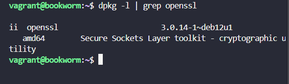

2. Se crearon dos usuarios (jenny y vasquez) con contraseñas cifradas utilizando los comandos:
 ```bash
   sudo sh -c "echo -n 'jenny:' >> /etc/nginx/.htpasswd"
   ```
 ```bash
   sudo sh -c "openssl passwd -apr1 >> /etc/nginx/.htpasswd"
   ```
 ```bash
   sudo sh -c "echo -n 'vasquez:' >> /etc/nginx/.htpasswd"
   ```
 ```bash
   sudo sh -c "openssl passwd -apr1 >> /etc/nginx/.htpasswd"
   ```
Verificamos que los usuarios se crearon correctamente

 ```bash
   cat /etc/nginx/.htpasswd
   ```
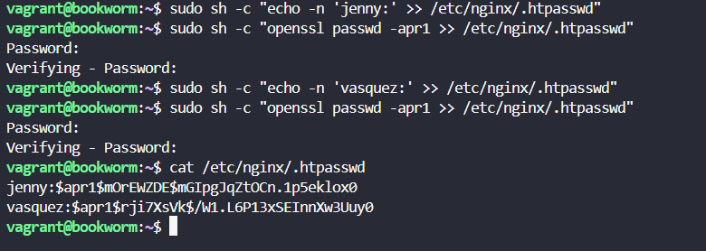

3. Se modificó el archivo de configuración de Nginx (en sites-available/taylorweb) para añadir la autenticación básica, vinculando el archivo .htpasswd para que los usuarios se autentiquen antes de acceder al contenido.
 ```bash
   sudo nano /etc/nginx/sites-available/taylorweb
   ```
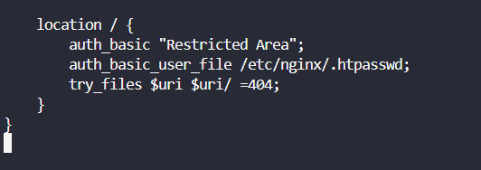

 ```bash
   sudo nginx -t
   ```
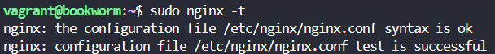

4. Al intentar acceder al sitio web, se mostró un cuadro de autenticación básica pidiendo el usuario y la contraseña. Se verificó que la autenticación funcionara correctamente y se pudo acceder al contenido como se muestra a continuación.

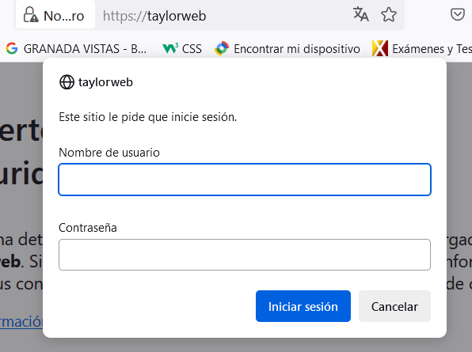 
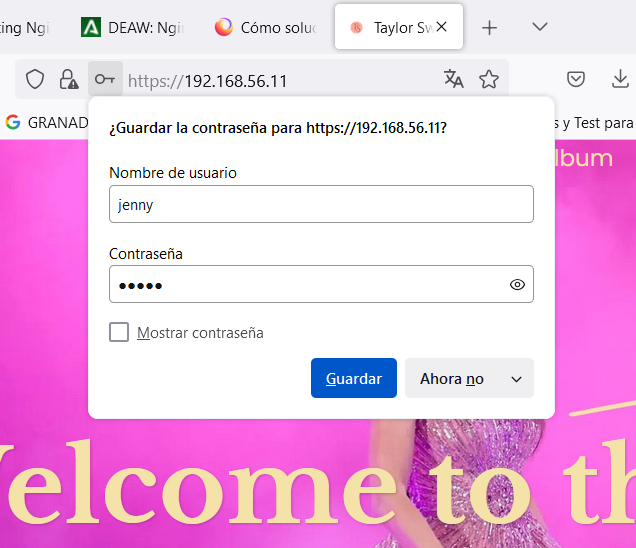

Ahora podemos visualizar la pagina.

5. Se comprueban los logs de acceso y error de Nginx para verificar el correcto funcionamiento y registrar los accesos:
   
 ```bash
sudo cat /var/log/nginx/error.log | tail -2
sudo cat /var/log/nginx/access.log | tail -2
   ```
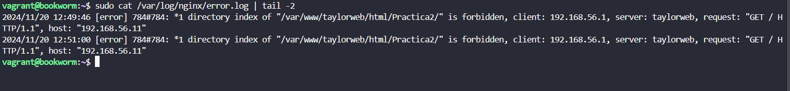 
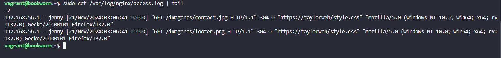

6. Redirección a Página de Contacto
 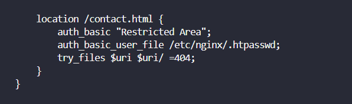
 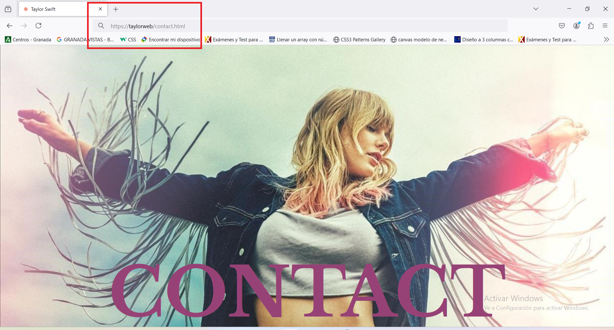

 7. Se incluyen restricciones de IP para permitir el acceso solo desde ciertas direcciones IP.
  
 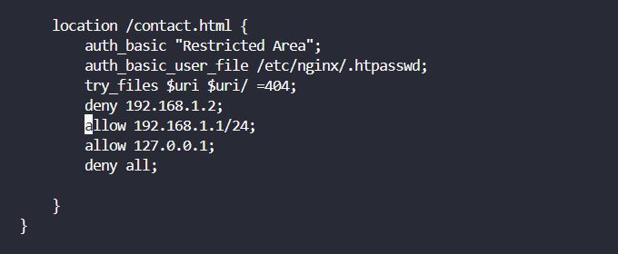

  Error de acceso desde ip incorrecta 

  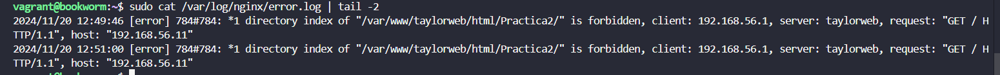
 
## Conclusión
En este proyecto, configuramos un servidor web para que solo algunas personas pudieran ver las páginas. Lo hicimos de dos maneras:

- Contraseñas

- Direcciones IP

De estas dos formas, podemos proteger las páginas de usuarios que no queremos que las vean, asegurándonos de que solo las personas correctas puedan acceder a ella.


# Nginx-Acceso Seguro

Previamente la configuracion de nuestra maquina debe estar correcta, para ello hemos realizado los siguientes pasos.

### 1. Instalación y Configuración de Nginx
1. **Vagrant** instalado en tu sistema.
2. **VirtualBox** u otro proveedor compatible con Vagrant.
3. Acceso a Internet para descargar la caja base y dependencias.
4. Un repositorio Git accesible para la clonación (en este caso: `https://github.com/Jenny-Vasquez/Practica2.git`).
5. La configuración del servidor se ajustó de la siguiente forma:

    ```nginx
   server{
       listen 80;
       listen [::]:80;
       server_name taylorweb;
   
       root /var/www/taylorweb/html/Practica2;
       index index.html index.htm index.nginx-debian.html;
   
       location / {
           try_files $uri $uri/ =404;  
       }
   }
    
6. Se verificó que la configuración estuviera correcta ejecutando:
   
   ```bash
   sudo nginx -t
   ```
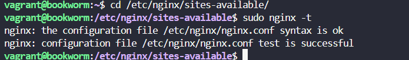

### 2. Configuración del Cortafuegos

1. Se instaló y configuró el cortafuegos **UFW** para proteger la máquina virtual:
   ```bash
   sudo apt update
   sudo apt install ufw
   ```
2. Se realizaron las siguientes configuraciones:
   - Permitir SSH:  
     ```bash
     sudo ufw allow ssh
     ```
   - Permitir tráfico seguro por HTTPS (Nginx Full):  
     ```bash
     sudo ufw allow 'Nginx Full'
     ```
   - Bloquear tráfico no seguro:  
     ```bash
     sudo ufw delete allow 'Nginx HTTP'
     ```
     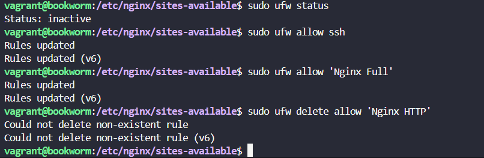 
3. Se activó el cortafuegos:
   ```bash
   sudo ufw enable
   ```
   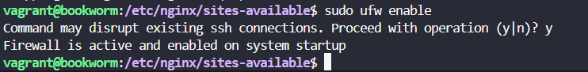 
4. El estado se verificó con:
   ```bash
   sudo ufw status
   ```
   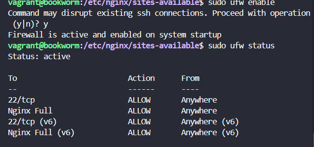 

### 3. Habilitación de HTTPS con Certificado Autofirmado

1. Se generó un certificado SSL autofirmado:
   ```bash
   sudo openssl req -x509 -nodes -days 365 -newkey rsa:2048 \
   -keyout /etc/ssl/private/taylorweb.key \
   -out /etc/ssl/certs/taylorweb.crt
   ```
   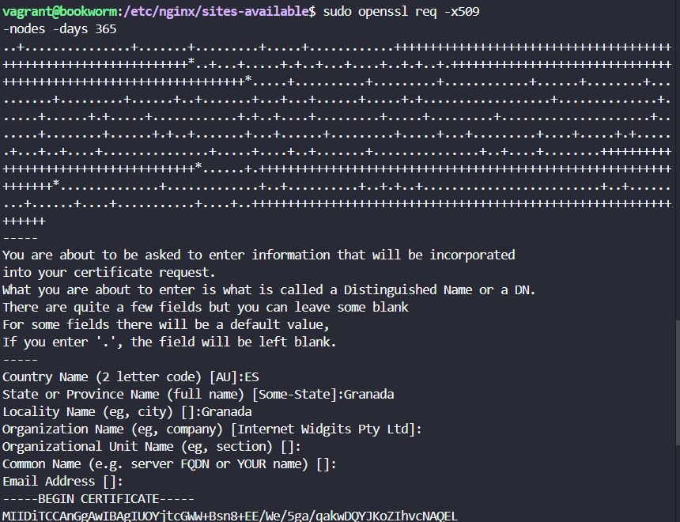
2. Se ajustaron los permisos de los archivos del certificado:
   ```bash
   sudo chmod 600 /etc/ssl/private/taylorweb.key
   sudo chmod 600 /etc/ssl/certs/taylorweb.crt
   ```
   

3. Se configuró Nginx para usar HTTPS en el puerto 443:
   ```nginx
   server {
       listen 443 ssl;  # Puerto HTTPS
       server_name taylorweb;

       root /var/www/taylorweb/html/Practica2;
       index index.html index.htm;

       ssl_certificate /etc/ssl/certs/taylorweb.crt; 
       ssl_certificate_key /etc/ssl/private/taylorweb.key;  

       ssl_protocols TLSv1.2 TLSv1.3; 

       location / {
           try_files $uri $uri/ =404;
       }
   }
   ```

4. Se verificó la configuración nuevamente:
   ```bash
   sudo nginx -t
   ```
 
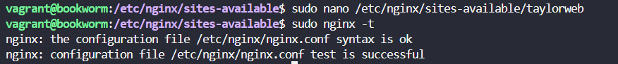

## Resultados

El servidor está configurado para usar HTTPS, pero como el certificado SSL es **autofirmado**, los navegadores mostrarán una advertencia indicando que la conexión no es completamente segura. 

### Mensaje en el Navegador

Al acceder al sitio en un navegador mediante `https://taylorweb`, se muestra un mensaje indicando que la conexión no es completamente segura, lo que significa que los datos intercambiados entre el navegador y el sitio no están cifrados.
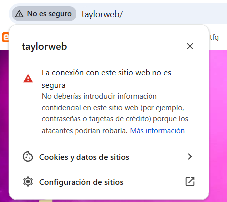

## IMAGENES DE LA CONFIGURACIÓN
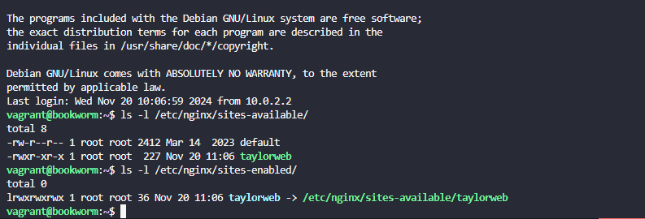
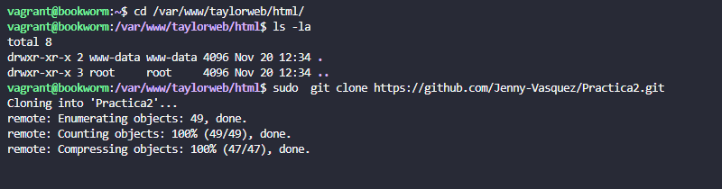

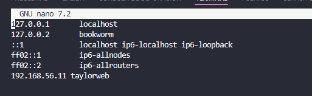
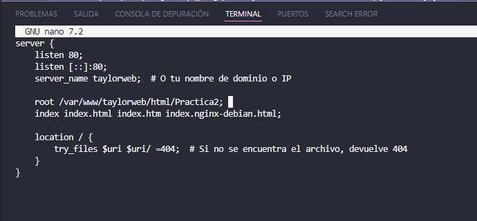
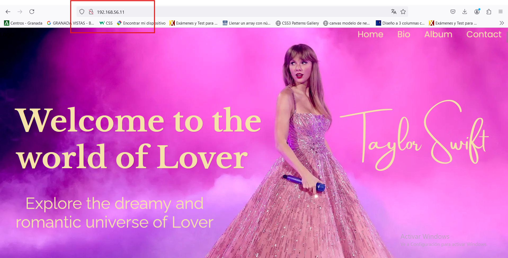
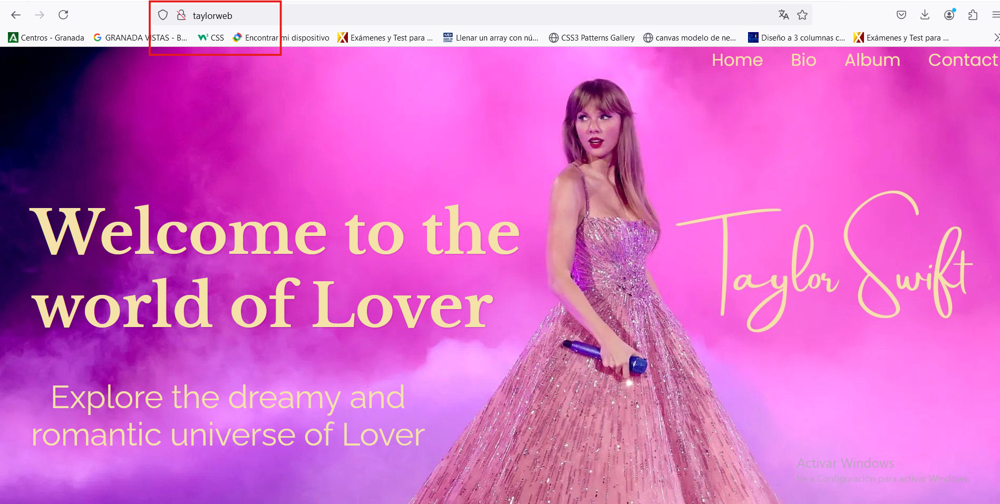
