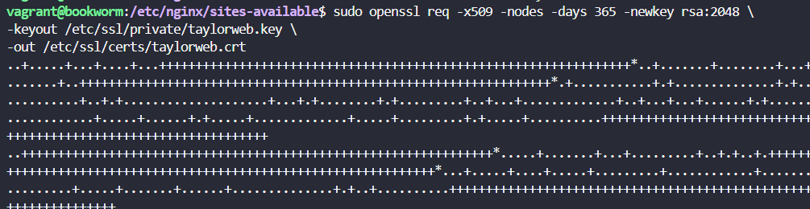

# Nginx-Autentificación

## Configuración de Máquina Virtual con Debian, Nginx y FTPS

Hemos configurado automáticamente una máquina virtual basada en Debian utilizando **Vagrant**. La configuración incluye:

- Instalación de **Nginx** y configuración personalizada para un sitio web.
- Implementación de un servidor FTPS seguro con **vsftpd**.
- Clonación de un repositorio Git en nuestro caso https://github.com/Jenny-Vasquez/Practica2.git

Para este apartado de autentidicacion verificaremos si el paquete esta instalado. 
 ```bash
   dpkg -l | grep openssl
   ```


Creo los usarios con los siguientes comandos.
 ```bash
   sudo sh -c "echo -n 'jenny:' >> /etc/nginx/.htpasswd"
   ```
 ```bash
   sudo sh -c "openssl passwd -apr1 >> /etc/nginx/.htpasswd"
   ```
 ```bash
   sudo sh -c "echo -n 'vasquez:' >> /etc/nginx/.htpasswd"
   ```
 ```bash
   sudo sh -c "openssl passwd -apr1 >> /etc/nginx/.htpasswd"
   ```
Verifico que los usuarios se crearon correctamente
 ```bash
   cat /etc/nginx/.htpasswd
   ```

Modifico el archivo para añadir la autenticación y reinicio el servicio:
 ```bash
   sudo nano /etc/nginx/sites-available/taylorweb
   ```


 ```bash
   sudo nginx -t
   ```


Accedo a taylorweb y me sale la siguiente información:

  

Ahora puedo visualizar la pagina.

A continuación compruebo los logs de erroy y acceso:
 ```bash
sudo cat /var/log/nginx/error.log | tail -2
sudo cat /var/log/nginx/access.log | tail -2
   ```
  

Redirecciono la pagina para cuando acceda me aparezca la pagina de contact
 
  


# Nginx-Acceso Seguro

Previamente la configuracion de nuestra maquina debe estar correcta, para ello hemos realizado los siguientes pasos.

### 1. Instalación y Configuración de Nginx
1. **Vagrant** instalado en tu sistema.
2. **VirtualBox** u otro proveedor compatible con Vagrant.
3. Acceso a Internet para descargar la caja base y dependencias.
4. Un repositorio Git accesible para la clonación (en este caso: `https://github.com/Jenny-Vasquez/Practica2.git`).
5. La configuración del servidor se ajustó de la siguiente forma:

    ```nginx
   server{
       listen 80;
       listen [::]:80;
       server_name taylorweb;
   
       root /var/www/taylorweb/html/Practica2;
       index index.html index.htm index.nginx-debian.html;
   
       location / {
           try_files $uri $uri/ =404;  
       }
   }
    
6. Se verificó que la configuración estuviera correcta ejecutando:
   
   ```bash
   sudo nginx -t
   ```


### 2. Configuración del Cortafuegos

1. Se instaló y configuró el cortafuegos **UFW** para proteger la máquina virtual:
   ```bash
   sudo apt update
   sudo apt install ufw
   ```
2. Se realizaron las siguientes configuraciones:
   - Permitir SSH:  
     ```bash
     sudo ufw allow ssh
     ```
   - Permitir tráfico seguro por HTTPS (Nginx Full):  
     ```bash
     sudo ufw allow 'Nginx Full'
     ```
   - Bloquear tráfico no seguro:  
     ```bash
     sudo ufw delete allow 'Nginx HTTP'
     ```
      
3. Se activó el cortafuegos:
   ```bash
   sudo ufw enable
   ```
    
4. El estado se verificó con:
   ```bash
   sudo ufw status
   ```
    

### 3. Habilitación de HTTPS con Certificado Autofirmado

1. Se generó un certificado SSL autofirmado:
   ```bash
   sudo openssl req -x509 -nodes -days 365 -newkey rsa:2048 \
   -keyout /etc/ssl/private/taylorweb.key \
   -out /etc/ssl/certs/taylorweb.crt
   ```
   
2. Se ajustaron los permisos de los archivos del certificado:
   ```bash
   sudo chmod 600 /etc/ssl/private/taylorweb.key
   sudo chmod 600 /etc/ssl/certs/taylorweb.crt
   ```
   

3. Se configuró Nginx para usar HTTPS en el puerto 443:
   ```nginx
   server {
       listen 443 ssl;  # Puerto HTTPS
       server_name taylorweb;

       root /var/www/taylorweb/html/Practica2;
       index index.html index.htm;

       ssl_certificate /etc/ssl/certs/taylorweb.crt; 
       ssl_certificate_key /etc/ssl/private/taylorweb.key;  

       ssl_protocols TLSv1.2 TLSv1.3; 

       location / {
           try_files $uri $uri/ =404;
       }
   }
   ```

4. Se verificó la configuración nuevamente:
   ```bash
   sudo nginx -t
   ```
 


## Resultados

El servidor está configurado para usar HTTPS, pero como el certificado SSL es **autofirmado**, los navegadores mostrarán una advertencia indicando que la conexión no es completamente segura. 

### Mensaje en el Navegador

Al acceder al sitio en un navegador mediante `https://taylorweb`, se muestra un mensaje indicando que la conexión no es completamente segura, lo que significa que los datos intercambiados entre el navegador y el sitio no están cifrados.


## IMAGENES DE LA CONFIGURACIÓN


